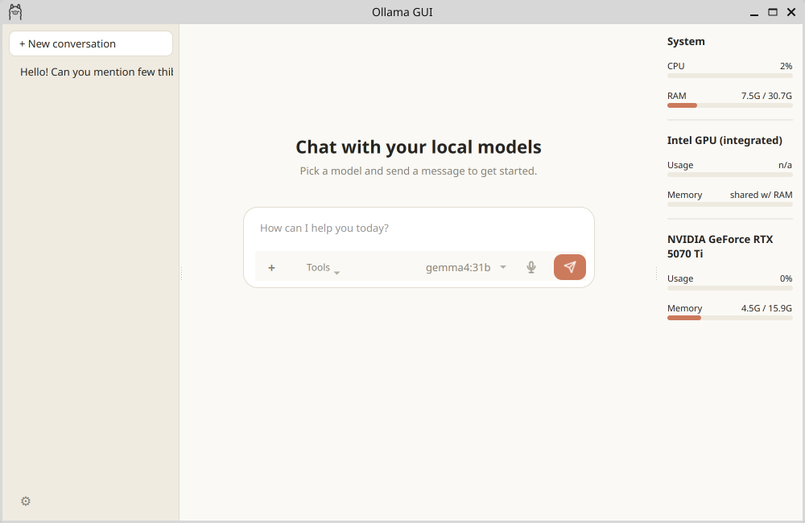
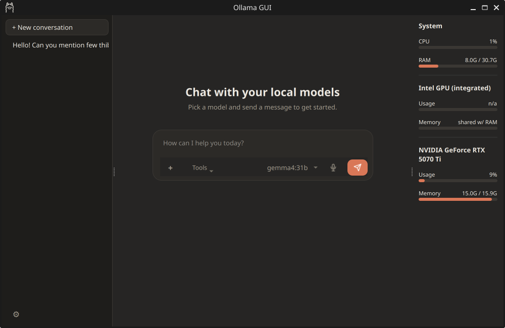
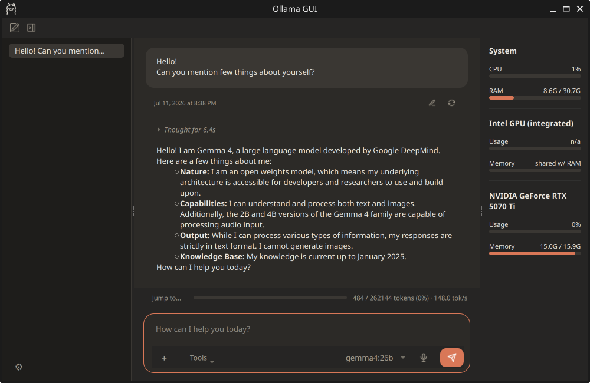
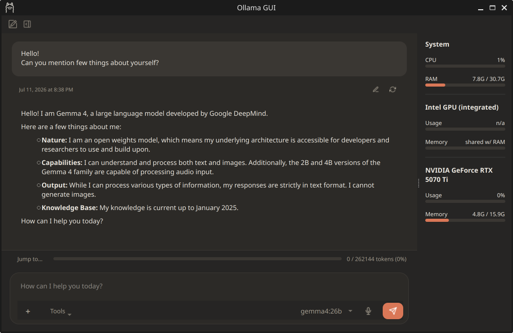

<p align="center">
  
</p>

<h1 align="center">LinOllama</h1>

<p align="center">
A beautiful native Linux desktop client for Ollama.
</p>

<p align="center">


</p>

LinOllama is a native Linux desktop client for [Ollama](https://ollama.com) built with modern C++ and Qt6.

Unlike browser-based interfaces, LinOllama feels like a first-class desktop application with a system tray, conversation management, local voice transcription, hardware monitoring, and deep Linux integration in the spirit of Claude Desktop's look and feel.


## Why LinOllama?

Unlike web-based clients, LinOllama is designed to feel like a true desktop application.

- Native Qt6 interface
- Lightweight
- No Electron
- No browser
- Local-first
- Deep Linux integration
- Built for power users

## ✨ Showcase

### Overview

| Light Theme | Dark Theme |
|------------|------------|
|  |  |using the dark theme. |

### Conversation

| Chat view colapsed | Chat view expanded |
|--------------------|--------------------|
|  |  |

## 🚀 Features

> Everything run locally. Not data sent online (except if specifically requeted). **Max privacy, full control!**

- 🎙 Local Whisper.cpp speech-to-text
- 🖥 Native Qt6/C++ implementation (no Electron)
- 📊 Real-time CPU/RAM/GPU monitoring
- 🎤 Mic monitoring when in use
- 🔄 Conversation queue management
- 🎨 Dynamic theming
- 📎 File and image attachments
- 📌 Embedded maps and HTML rendering
- 🔧 Deep integration with the Ollama server and Linux desktop

### 💬 Chat

- **Multiple conversations**, listed in a resizable sidebar (create via "+
  New conversation" or just start typing on the empty-state screen); delete
  via each row's hover "⋮" menu or right-click. Titles are auto-derived from
  the first message.
- **Streaming replies**, rendered as Markdown (bold, lists, code blocks,
  tables, links) via Qt's native rich text engine — not raw `**bold**`
  source text.
- **Background generation**: switching to a different conversation does
  **not** interrupt a reply that's still streaming. Switch back and it's
  either still going or already finished, exactly as if you'd never left.
- **One request at a time, queued**: Ollama can really only generate well
  for one model at a time, so if you send messages in several conversations
  in a row, they queue up rather than all hitting the server at once. By
  default they run strictly in the order you sent them, even if that means
  reloading a model repeatedly as you bounce between conversations that use
  different models. Settings → Model → **"Queing model optimization"**
  (off by default) lets the queue instead prefer whichever waiting turn
  matches the model that's already loaded, to cut down on reload churn, at
  the cost of not preserving strict send order.
- **Per-conversation model**: picked once, locked in after the first
  message (Ollama has no notion of switching models mid-chat).
- **Thinking/reasoning trace**: for models that stream Ollama's separate
  `message.thinking` field, it shows as a collapsible section above the
  answer, auto-expanding while it's happening and auto-collapsing once the
  real answer starts. Not persisted to disk — reopening an old conversation
  shows only the final answer, never its reasoning trace.
- **Edit and retry** any past prompt. Editing the *last* prompt just
  regenerates its reply in place. Editing an *earlier* one forks into a
  brand-new conversation (with confirmation) instead of destroying
  everything built on top of it — the original conversation is left exactly
  as it was, including any reply still generating in the background.
- **File attachments**: any file via the "+" button. Text-like files are
  read and appended to your message as context (skipped if they look
  binary); images (`png/jpg/jpeg/gif/bmp/webp`) are base64-encoded and sent
  via Ollama's vision `images` field, for models that support it.
- **Tool calling**: "Tools" toggles for **Search Wikipedia** (not a
  general web search engine, see Limitations), **Search Stack Overflow**
  (via the public Stack Exchange API — free, keyless, for programming
  questions/error messages specifically), **Calculator** (exact
  arithmetic, `+ - * / % ^` and parentheses), and **Current date &
  time**. Unlike a plain toggle that always runs before sending, enabling
  one just makes it available (via Ollama's `tools` API) — the model
  itself decides, per reply, whether to actually call it, and can chain
  several calls before answering. Each call and its result show as a
  collapsible section above the reply, same as the "Thinking" trace.
  Requires a tool-calling-capable model (e.g. Llama 3.1+, Qwen2.5+,
  Mistral Nemo); on a model without that support, an enabled tool is
  simply never called.
- **Voice button**: hold to record, release to transcribe (via a local
  [Whisper](https://github.com/ggerganov/whisper.cpp) model — nothing is
  sent anywhere). The input box fills in live as text comes back, not just
  once the whole recording is processed. By default it's left in the box for
  you to review/correct before hitting Send yourself; Settings →
  **"Send automatically after transcription"** switches to sending it
  straight to Ollama with no review step. See "Voice transcription" below
  for setup.
- **Rich replies**: fenced ` ```html ` blocks render in a real, isolated
  Chromium view (JavaScript, `<canvas>`, CSS3 — Chart.js-style charts and
  similar just work), with a "View source" toggle to see the model's
  original raw reply instead; remote `` URLs elsewhere in a reply load
  asynchronously; fenced ` ```map ` blocks (`{"query": "...", "zoom": N}`)
  render as an embedded Google Maps view.
- **Context-window usage bar** between the message list and the input box,
  showing tokens used vs. the model's real context length (fetched from
  Ollama, not guessed).
- Optional custom context length (`options.num_ctx`) in Settings — off by
  default, in which case Ollama picks its own default. There is **no**
  "unlimited context" mode; every model has a hard ceiling from its own
  metadata that Ollama enforces regardless of what's requested.
- Optional generation parameters (Settings → Ollama → Generation
  parameters) — temperature, top_p, top_k, seed, max tokens
  (`num_predict`), repeat penalty, and stop sequences, all gated by one
  "Use custom generation parameters" toggle. Off by default, in which case
  Ollama's own built-in defaults apply exactly as before.

### 🎙️ Voice transcription

- Local speech-to-text via [whisper.cpp](https://github.com/ggerganov/whisper.cpp)'s
  `whisper-cli` binary, shelled out to per recording — no cloud service, no
  network call, no API key.
- **Auto-detection**: looks for `whisper-cli` and a `models/` folder at the
  usual `~/whisper.cpp/build/bin/whisper-cli` location (falling back to
  `PATH` and a couple of common install paths), both overridable in Settings.
- **Model manager in Settings**: a compact table (Model/Speed/Accuracy plus
  a Download-or-Use action; hover a row for disk size/memory/language/usage,
  or expand the table for all columns at once) covering `tiny` through
  `large-v3`, `.en` (English-only) variants included. Downloads straight
  from Hugging Face with a progress bar.
- **Default model picked automatically**: `medium` if it's downloaded, else
  the best available among `large-v3` → `large-v3-turbo` → `small` → `base`
  → `tiny` — never auto-picking an `.en` (English-only) model over a
  multilingual one. Sticks once chosen (or once you pick one yourself) across
  restarts.
- **Microphone picker in Settings**, listing every input device Qt can see,
  plus a live **"Mic" meter in the system stats strip** (CPU/RAM/GPU panel)
  so you can actually see whether the selected device is producing signal
  while you record — independent of whether the recording itself later comes
  back silent, which makes it a genuine diagnostic, not just a decoration.
- Recording is captured raw (not via a higher-level encoder pipeline),
  downmixed to mono, resampled to the exact 16 kHz/16-bit PCM whisper.cpp
  requires, and written to a temp WAV on a RAM-backed `tmpfs` (`/dev/shm`)
  when available — deleted immediately after transcription, win or lose.
- **Live transcription while still talking** — off by default, opt in via
  Settings → Voice transcription → **"Enable live transcription"** (grayed
  out until a `whisper-server` binary is found; a status line there says
  whether it was, with a button to point at one manually). When on,
  `whisper-server` — a second binary from the same whisper.cpp checkout,
  built from its `examples/server` — loads the model once and stays warm,
  and the recording is sliced into chunks at natural pauses in speech (a
  short energy-threshold silence detector, not fixed time windows, so
  words don't get cut mid-syllable at a chunk boundary; capped at 8s so a
  long run-on sentence still gets transcribed periodically) and streamed
  to the message box chunk by chunk as you talk, instead of waiting until
  you release the button. Audio capture always takes priority — a slow/
  backed-up chunk transcription never blocks or drops captured audio, it
  just falls behind and catches up. With the setting off (or no
  `whisper-server` built), voice transcription works exactly as described
  above instead — once, on release; `whisper-cli` alone reloads its whole
  model on every invocation, too slow to re-run every few seconds.

### 🗔 Tray

- Tray icon (left-click opens the main window; right-click for the menu)
  with: live status, Start/Stop server, an "Offload model" submenu (frees a
  loaded model's VRAM immediately instead of waiting for its idle timeout),
  "Open Ollama GUI", and Quit.
- Hover tooltip with live CPU%, RAM used/total, and per-GPU utilization/VRAM.
- Server control detects and uses whichever mechanism actually owns the
  running server — a systemd **user** service, a systemd **system** service
  (via `pkexec` for a proper native auth prompt, not `sudo`), or a plain
  `ollama serve` process it manages directly — rather than assuming one.
- **Server environment overrides** (Settings → Ollama): `OLLAMA_MODELS`,
  `OLLAMA_KEEP_ALIVE`, `OLLAMA_FLASH_ATTENTION`, `OLLAMA_NUM_PARALLEL` —
  applied the next time Start is used. For a systemd **user** service, a
  drop-in override (`~/.config/systemd/user/ollama.service.d/override.conf`)
  is written and reloaded automatically; for a plain process this app
  starts, they're just set directly in its environment. A systemd
  **system** service isn't modified (see Limitations).
- **Pull and delete models** (Settings → Ollama → Models): pull any model
  reference Ollama itself understands (`llama3.2`, `llama3.2:3b`, ...) with
  a live progress bar (`/api/pull`, cancellable mid-download), and delete
  installed ones you no longer want (`/api/delete`, with a confirmation
  dialog) — no more dropping to the `ollama` CLI just to manage what's
  installed.

### 📊 System monitoring

- CPU (`/proc/stat`) and RAM (`/proc/meminfo`) need no extra dependencies.
- GPU: enumerates every `/sys/class/drm/cardN` device and identifies each
  one's vendor from its PCI ID. **Multiple GPUs of mixed vendors are fully
  supported** and shown as a list, not just a single card.
  - **NVIDIA**: via NVML, loaded at runtime with `dlopen` — no NVIDIA driver
    or CUDA toolkit needed to *build* the app, and it runs fine on machines
    with no NVIDIA hardware at all.
  - **AMD**: read directly from sysfs (`amdgpu`).
  - **Intel**: utilization only, best-effort (varies by driver); VRAM is
    reported as unavailable since it's shared with system RAM.

### 🎡 Appearance

- Light / Dark / Auto theme (Auto follows the OS live on Qt 6.5+).
- Customizable accent color, applied app-wide, plus independent colors for
  each of the four stats meters (CPU/RAM/GPU/VRAM) — all with a one-click
  reset back to default.
- Choice of Send button style (paper-plane icon, arrow, or text label).
- Themed app icon (tray, window/taskbar, and every dialog) that follows the
  active theme — black on light, light-on-dark — rather than a fixed color.
- Some icons are originaly from [System UI Line icon pack](https://www.svgrepo.com/collection/system-ui-line-icons)

## 🗎 Requirements

- **Ollama itself, installed separately and reachable at
  `http://127.0.0.1:11434`** — this app is a client, it doesn't bundle or
  install Ollama. If Ollama isn't on `PATH`, the tray's Start/Stop won't be
  able to launch it directly (systemd-managed installs are unaffected,
  since that path doesn't need `PATH` at all).
- A working system tray. On **GNOME**, this means installing and enabling
  the AppIndicator/KStatusNotifierItem extension first — GNOME doesn't
  support tray icons out of the box, and the app will refuse to start
  without one.
- **Optional, for voice transcription**: a built
  [whisper.cpp](https://github.com/ggerganov/whisper.cpp) — clone it,
  `cmake -B build && cmake --build build --target whisper-cli`, and download
  at least one `ggml-*.bin` model (Settings' model manager can do this part
  for you). Everything else in the app works fine without it; the voice
  button just reports it isn't configured yet.
  ```bash
  git clone https://github.com/ggerganov/whisper.cpp ~/whisper.cpp
  cd ~/whisper.cpp
  cmake -B build
  cmake --build build --target whisper-cli -j$(nproc)
  ```
  If you do not want to install ccache `sudo apt install ccache`, you can 
  ignore it by `rm -rf build & cmake -B build -DGGML_CCACHE=OFF & cmake --build build --target whisper-server -j$(nproc)` (rm -rf build is needed here since the existing build/ was already configured with ccache detected — a fresh configure is what picks up -DGGML_CCACHE=OFF.).
- **Optional, for *live* transcription while still talking**: additionally
  build the `whisper-server` target from that same checkout — it's
  whisper.cpp's own `examples/server`, not a separate download:
  ```bash
  cd ~/whisper.cpp
  cmake --build build --target whisper-server -j$(nproc)
  ```
  (Building both targets from scratch: `cmake -B build && cmake --build
  build --target whisper-cli --target whisper-server -j$(nproc)`.) This
  drops `whisper-server` right next to `whisper-cli` in
  `~/whisper.cpp/build/bin/`, which is exactly where the app already looks
  — restart it (or reopen Settings → Voice transcription) and it should
  auto-detect it, same as `whisper-cli` itself. **You don't run
  `whisper-server` yourself** — the app launches and manages that process
  on its own, on a fixed local port, the first time you press-and-hold the
  mic button; there's no separate "start the server" step. If it isn't
  auto-detected, Settings → Voice transcription has a "Live server
  binary…" button to point at it manually. Without it, voice transcription
  still works exactly as above, just on release rather than live.
- Linux — GPU monitoring in particular is Linux-specific (sysfs, NVML via
  `dlopen`), and server control assumes systemd or a plain Unix process.

## 🖺 Dependencies

Qt6, plus a handful of its modules:

```bash
sudo apt install build-essential cmake \
    qt6-base-dev qt6-multimedia-dev qt6-svg-dev qt6-webengine-dev
```

| Module | What it's for |
|---|---|
| `qt6-base-dev` | Core, Widgets, Network |
| `qt6-multimedia-dev` | Voice recording (push-to-talk capture) |
| `qt6-svg-dev` | Themed SVG icon rendering |
| `qt6-webengine-dev` | Embedded map view in chat replies |

No NVIDIA/AMD vendor SDK is needed at build time — GPU support is resolved
entirely at runtime.

## 🏗️ Build & run

```bash
cmake -B build -DCMAKE_BUILD_TYPE=Release
cmake --build build -j
./build/linollama
```

Or a one-line build command
```bash
rm -rf build && cmake -B build -DCMAKE_BUILD_TYPE=Release && cmake --build build -j
./build/linollama
```

There's no install step required to run it locally; `cmake --install build`
will place the binary under `bin/` (via `RUNTIME DESTINATION bin`) if you
want it on `PATH` elsewhere.

**Launching from an app menu**: `linollama.desktop` (checked in at the
repo root) points at this checkout's own `build/linollama` and
`src/icons/ollama-app-icon.svg` — a static-color copy of the in-app themed
icon, since a `.desktop` file can't do the `{{iconColor}}` light/dark
substitution the app itself does at runtime (see `Theme::loadThemedIcon()`).
Copy or symlink it into `~/.local/share/applications/` to add it to your
launcher:

```bash
ln -s "$(pwd)/linollama.desktop" ~/.local/share/applications/
update-desktop-database ~/.local/share/applications  # optional, most DEs pick it up automatically
```

See Limitations if you move this checkout elsewhere afterward.

## 🗂️ Data & configuration

- **Conversations**: one JSON file per conversation, at
  `~/.local/share/LinOllama/LinOllama/conversations/<uuid>.json`. Deleting one
  through the app removes its file; there's no separate export/import.
- **Settings**: `~/.config/LinOllama/LinOllama.conf` (theme, accent/meter
  colors, send button style, context-length override, model-optimization
  toggle, Whisper binary/models-folder/selected-model paths, microphone
  device, Ollama server environment overrides). Delete this file to reset
  everything to defaults.
- **Systemd user drop-in** (only written if a systemd *user* `ollama.service`
  unit exists and at least one server environment override is set):
  `~/.config/systemd/user/ollama.service.d/override.conf`.
- Nothing is sent anywhere except your configured Ollama server, your
  selected microphone → the local whisper.cpp process (never leaves the
  machine), and — only when a search tool is enabled *and* the model
  actually decides to call it — Wikipedia's or the Stack Exchange API's
  public endpoints.

## ⛔ Known limitations

- **No in-app whisper.cpp build/install automation.** The app auto-detects
  an existing `whisper-cli` binary and can download *models*, but you still
  need to clone and build whisper.cpp yourself first — see Requirements.
  Also CPU-only: there's no GPU-acceleration toggle for transcription.
- **Web search is Wikipedia-only.** It's a genuinely useful "look this up"
  tool, but it is not a general web search engine — general search engines
  either block non-browser API access or require a paid key, and adding one
  (e.g. Brave Search) would need a user-supplied API key in Settings, which
  isn't built yet.
- **Only built-in tools, no custom/user-defined ones.** Tool calling is
  limited to the four tools LinOllama ships with — there's no Settings
  UI yet for defining your own (e.g. a webhook-backed tool). A single turn
  also caps at 4 chained tool-call rounds before the app forces a final
  answer, as a guard against a model that keeps calling tools without ever
  actually answering.
- **Live transcription's chunking isn't tunable.** The silence-detection
  threshold and min/max chunk lengths (see "Voice transcription" above)
  are fixed constants, not exposed in Settings — a very quiet room/mic
  gain could in principle need a different threshold than the hardcoded
  default to reliably detect pauses.
- **No remote/non-default Ollama host setting.** The client can technically
  point at a different base URL, but there's no Settings UI to configure it
  yet — it's hardcoded to `http://127.0.0.1:11434`.
- **Server environment settings (Settings → Ollama) only take effect via a
  systemd *user* service or a plain process this app starts directly.** A
  systemd *system* service isn't touched automatically (would need `pkexec`
  to write a root-owned unit file) — set `OLLAMA_MODELS`, `OLLAMA_KEEP_ALIVE`,
  `OLLAMA_FLASH_ATTENTION`, and `OLLAMA_NUM_PARALLEL` in its own unit file
  instead. Also: these only apply the next time Ollama is *(re)started* via
  the tray's Start/Stop, not to a server that's already running.
- **Model pull progress is per-layer, not a single combined total.** Ollama's
  own `/api/pull` stream reports progress one layer at a time (its own
  reporting granularity, not something this app controls), so the progress
  bar in Settings → Ollama → Models visibly resets a few times while
  pulling a multi-layer model rather than climbing smoothly to 100% once.
- **Map embeds use Google's unofficial, keyless "Embed a map" URL pattern**
  (not the documented, key-required Maps Embed API). No API key needed, but
  it's undocumented behavior that could change without notice. One
  query/marker per map block, no multi-stop routes.
- **Conversations can't be renamed** through the UI (only auto-titled from
  the first message), and there's no rename/archive/export flow.
- **The `.desktop` launcher entry points at a `build/` path, not an
  installed one** — `linollama.desktop`'s `Exec`/`Icon` reference this
  checkout's own `build/linollama` binary and `src/icons/` directly
  (there's no `make install` step that copies them anywhere system-wide),
  so it'll break if this directory is moved and needs re-generating/editing
  by hand for a packaged install.

## 🔍 Troubleshooting

**"No system tray detected" on startup.**
GNOME doesn't support tray icons without an extension — install and enable
AppIndicator/KStatusNotifierItem (e.g. via GNOME Extensions), then relaunch.
Other desktop environments (KDE, XFCE, Cinnamon, etc.) generally support
tray icons natively.

**Tray icon looks like a plain drawn circle with "O" instead of the Ollama logo.**
This is a guaranteed-valid fallback used if the bundled icon somehow fails
to load — check the terminal output for a warning. It shouldn't normally
happen since the icon is compiled into the binary as a Qt resource.

**Tray icon or window icon doesn't recolor when I switch themes.**
It should update live — if it doesn't, that's a bug; a full app restart is
a reasonable workaround in the meantime.

**"Couldn't start `ollama serve`" from the tray.**
The loose-process fallback only fires when no systemd unit is found in
either the user or system scope, and it shells out to `ollama` by name — it
needs to be on `PATH` for whichever user account is running this app.
Confirm with `which ollama`, or start Ollama yourself and the app will pick
up on it as an externally-managed process instead.

**Stopping/starting the server via systemd asks for a password unexpectedly, or nothing happens.**
System-scope (not user-scope) systemd units go through `pkexec`, which pops
a native polkit authentication dialog — if that dialog doesn't appear (some
minimal window managers don't have a polkit agent running), the action will
silently fail. Installing your desktop environment's polkit agent (usually
already present on GNOME/KDE/XFCE) fixes this.

**Context-usage bar shows "context size unknown."**
The model's context length is fetched from Ollama via `/api/show` the first
time you use it and cached; this can briefly show "unknown" right after
picking a model, or permanently on a very old Ollama version whose
`/api/show` response doesn't expose `context_length` in a format this app
recognizes.

**A reply just stops with no error.**
Check that Ollama itself hasn't crashed or run out of VRAM — the tray
tooltip's live stats and the "Offload model" list are good first places to
look. If a different conversation's turn was queued behind this one and a
model swap was needed, also check whether the swap (an explicit unload)
actually completed on the Ollama side.

**Voice transcription fails or says it isn't configured.**
Check Settings' "Voice transcription (Whisper)" section: it needs a built
`whisper-cli` binary and at least one downloaded model (both auto-detected
from a standard `~/whisper.cpp` checkout, or set manually). If a model is
selected but transcription still comes back empty, check the "Mic" meter in
the system stats strip while holding the record button — if it doesn't move
at all, the wrong input device is likely selected in Settings' microphone
picker; if it does move but transcription still fails, the error message
now surfaces whisper-cli's actual diagnostic line rather than a generic one.

**Live (while-still-talking) transcription never kicks in — it always waits until release.**
First check the **"Enable live transcription"** checkbox in Settings →
Voice transcription is actually on — it's off by default even once
`whisper-server` is built, on purpose (see that setting's own hint text).
If it's grayed out, check the status line for "Live server
(whisper-server):" — "not found" means you don't have that binary built
yet (see Requirements above for the exact `cmake --build` command; it's a
second target from the same whisper.cpp checkout, not a separate project).
If the checkbox is on and the binary's found but nothing streams in while
you talk, hold the mic button and watch for an error bubble —
`ensureLiveServerRunning()` reports a failure (e.g. the selected model
isn't downloaded, or the port couldn't be bound) that way rather than
failing silently.

## Contributing / project layout

Single Qt6 Widgets application, no QML. Key files:

- `MainWindow` — the sidebar + chat + stats-strip window.
- `ChatWidget` — message rendering, streaming, editing/retry, attachments.
- `ChatQueue` — serializes/schedules turns across conversations against the
  one real Ollama server.
- `OllamaClient` — thin wrapper over Ollama's REST API, multi-stream-capable.
- `WhisperManager` — detects/configures `whisper-cli` and its models,
  downloads new ones, runs push-to-talk transcription as a subprocess, and
  (if `whisper-server` is available) manages a persistent live-transcription
  server process plus the HTTP chunk queue talking to it.
- `VoiceRecorder` — raw microphone capture (push-to-talk), live level
  metering, 16 kHz mono WAV encoding for `WhisperManager`, and (in live
  mode) silence-triggered chunk cutting.
- `ConversationStore` — in-memory conversation list mirrored to per-file JSON.
- `SystemMonitor` — CPU/RAM/GPU polling.
- `ServerController` — detects and drives whichever mechanism (systemd
  user/system, or a raw process) actually owns the Ollama server.
- `TrayApplication` — tray icon, menu, tooltip.
- `Theme` / `ThemeManager` — the app's QSS stylesheet and light/dark/auto
  resolution.

No automated test suite exists yet; changes have generally been verified by
building, running, and exercising the relevant feature manually.

# 📄 License

LinOllama is free software licensed under the GNU General Public License v3.0 (GPL-3.0-only).

You are free to use, study, modify, and redistribute this software under the terms of the GNU GPL version 3.

Any distributed modified version or derivative work of LinOllama must also be licensed under GPLv3 and the corresponding source code must be made available.

See the LICENSE file for the complete license text.

LinOllama bundles Noto Emoji SVG images (`src/emoji/`) to render emoji
consistently across systems, regardless of what's installed on the host.
They are licensed separately under the SIL Open Font License 1.1 — see
`src/emoji/LICENSE`.